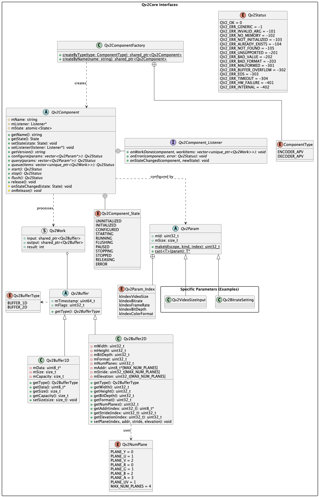

# Qv2Core Module Documentation

The `Qv2Core` module is the backbone of the QtVCodec framework, providing a component-based architecture for video processing. It is designed to be extensible, modular, and highly efficient.

## Architectural Overview

### Class Diagram
The relationships between the core classes (`Component`, `Work`, `Buffer`, and `Factory`) are illustrated below:



---

## Qv2Param Design: 32-bit Identifier System

To handle parameters flexibly without overhead, `Qv2Param` uses a **32-bit ID** generated using bit-packing. This allows for fast `switch-case` handling and semantic categorization.

### ID Structure Diagram:
```text
 31      28 27      24 23                                    0
+----------+----------+---------------------------------------+
|  Scope   |   Kind   |                 Index                 |
+----------+----------+---------------------------------------+
    |          |                        |
    |          |                        +--> Unique Parameter ID (24 bits)
    |          +--> SETTING(0), TUNING(1), INFO(2)
    +--> GLOBAL(0), INPUT(1), OUTPUT(2)
```

### How to use Qv2Param:
- **Scope**: Defines where the parameter applies (e.g., `INPUT` for resolution, `OUTPUT` for bitrate).
- **Kind**: Defines the behavior. `SETTING` is applied at config time, `TUNING` can change during runtime.
- **Index**: A unique hex code (e.g., `0x01` for VideoSize).

---

## Developer Guide: How to Use a Qv2Component

Using a component (Encoder or Decoder) follows a strict state-machine lifecycle.

### 1. Creation
Always use the `Qv2ComponentFactory` to instantiate components by type or name. This ensures proper abstraction.
```cpp
auto encoder = Qv2ComponentFactory::createByType(Qv2ComponentFactory::ENCODER_APV);
```

### 2. Configuration & Listener
Set a listener to handle asynchronous results and configure the component using a vector of `Qv2Param` pointers.
```cpp
encoder->setListener(myListenerPtr);

std::vector<Qv2Param*> params;
auto size = std::make_shared<Qv2VideoSizeInput>();
size->mWidth = 1920; size->mHeight = 1080;
params.push_back(size.get());

encoder->configure(params); // Transitions to CONFIGURED state
```

### 3. Execution Loop
Start the component and queue work items. A `Qv2Work` item typically contains an input `Qv2Buffer`.
```cpp
encoder->start(); // Transitions to RUNNING state

auto work = std::make_unique<Qv2Work>();
work->input = Qv2Buffer::CreateGraphicBuffer(myInputBlock);
encoder->queue(std::move(work));
```

### 4. Handling Results & Errors
You must implement the `Qv2Component::Listener` interface to receive asynchronous callbacks.

#### Implementing onWorkDone
This is where you retrieve the processed data (e.g., encoded bitstream or decoded frame).
```cpp
void onWorkDone(std::weak_ptr<Qv2Component> component, 
                std::vector<std::unique_ptr<Qv2Work>> workItems) override {
    for (auto& item : workItems) {
        // 1. Check if the specific work item succeeded
        if (item->result == QV2_OK) {
            // 2. Access the output buffer (Linear for bitstream, Graphic for frames)
            if (item->output && item->output->type() == Qv2Buffer::LINEAR) {
                auto block = item->output->linearBlocks()[0];
                // Process block->data() with size block->size()
            }
        }
        
        // 3. Check for End-of-Stream (EOS) flag
        if (item->flags & QV2_WORK_FLAG_EOS) {
            // Handle completion logic
        }
    }
}
```

#### Implementing onError
Handle critical component failures here.
```cpp
void onError(std::weak_ptr<Qv2Component> component, Qv2Status error) override {
    // Log the error and notify the application UI
    // Usually, you should stop or release the component after a fatal error
    printf("Component Error: %d\n", static_cast<int>(error));
}
```

### 5. Termination
Always release resources properly.
```cpp
encoder->stop();
encoder->release(); // Returns to UNINITIALIZED state
```

---

## Key Core Components
- **Qv2Component**: Interface and state management.
- **Qv2Buffer**: Thread-safe container for 1D (Linear) or 2D (Graphic) data blocks.
- **Qv2Work**: The atomic unit of data exchange between the client and the codec.
- **Qv2Errors**: Standardized error codes for the entire framework.
